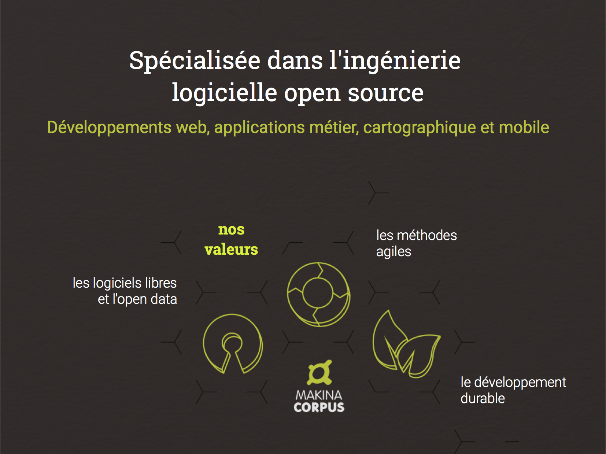
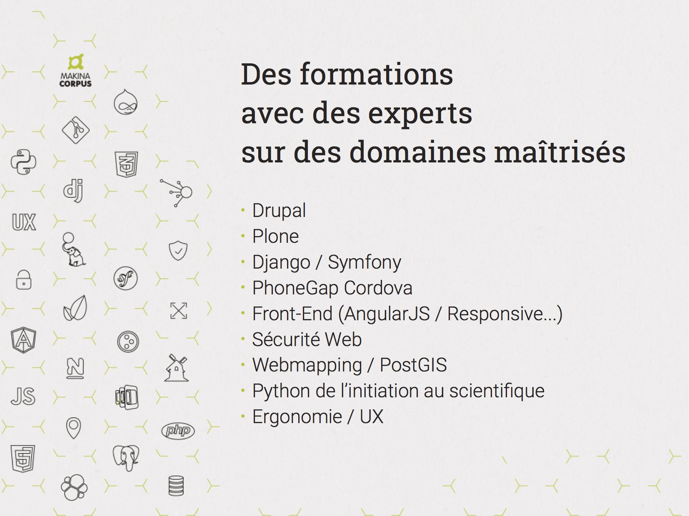

# Drupal 8 sans modules, si si c'est possible

.fx: alternate

--------------------------------------------------------------------------------

.fx: imageslide

--------------------------------------------------------------------------------

.fx: imageslide

--------------------------------------------------------------------------------

.fx: imageslide

--------------------------------------------------------------------------------

.fx: imageslide

--------------------------------------------------------------------------------

# Qui suis-je&nbsp;?

  Pierre RINEAU

  @pounard sur le web

  Développeur Drupal depuis 2008

.fx: alternate

--------------------------------------------------------------------------------

# Contexte

 * Et non, je ne fait pas (encore) de Drupal 8&nbsp;!

 * **J'aime pas la complexité.**

 * Mais du Symfony, des fois.

 * **J'aime le conteneur de services de Symfony.**

 * *J'aime pas la complexité.*

 * **Drupal 8 s'en sert&nbsp;! Détournons le&nbsp;!**

.fx: alernate
.fx: larger

--------------------------------------------------------------------------------

# Bootstrap du projet

.fx: titleslide

--------------------------------------------------------------------------------

## Bootstrap du projet - Comment c'est&nbsp;?

 * **app/config/**
 * **app/config/{active,sync}**
 * app/templates/ *~ (pas comme Symfony - mais bon...)*
 * **bin/**
 * **src/**
 * **var/cache/**
 * var/log/
 * var/private/
 * var/tmp/
 * web/ *~ Coucou Drupal&nbsp;!*
 * **composer.json**

--------------------------------------------------------------------------------

## composer.json

  > Oh oui&nbsp;! S'il te plaît montres-moi&nbsp;!

    !sh
    git checkout bootstrap

.fx: larger

--------------------------------------------------------------------------------

## composer.json - ce qu'il faut retenir

    !json
    {
        ...
        "require": {
            "drupal/console": "^1.0.1",
            "drupal/core": "~8.4",
            "drush/drush": "~9.0",
            ...
        },
        "config": {
            "bin-dir": "bin"
        },
        "autoload-dev" : {
            "psr-4" : {
                "MakinaCorpus\\Lannion\\Tests\\" : "tests/"
            }
        },
        "autoload" : {
            "psr-4" : {
                "MakinaCorpus\\Lannion\\" : "src"
            }
        },
        ...
    }

.fx: smaller

--------------------------------------------------------------------------------

## Hors de mon webroot&nbsp;!

    !php
    <?php

    use Drupal\Component\PhpStorage\FileStorage;
    use MakinaCorpus\Lannion\Lannion;

    define('APP_ROOT', Lannion::getProjectRoot());

    $config_directories = [
        CONFIG_ACTIVE_DIRECTORY => APP_ROOT.'/app/config/active',
        CONFIG_SYNC_DIRECTORY => APP_ROOT.'/app/config/sync',
    ];

    $settings['container_yamls'][] = APP_ROOT.'/app/parameters.yml';
    $settings['container_yamls'][] = APP_ROOT.'/app/config/services/core.yml';

    $GLOBALS['conf']['container_service_providers']['Lannion'] = Lannion::class;

    $settings['php_storage']['default'] = [
        'class' => FileStorage::class,
        'directory' => APP_ROOT.'/var/cache',
    ];

    $config['system.file']['path']['temporary'] = APP_ROOT.'/var/tmp';

    $databases['default']['default'] = [ /* ... */ ];

.fx: smaller

--------------------------------------------------------------------------------

## Et là ça marche pas&nbsp;?

> Et non&nbsp;! Drupal et Druche sont des *ugly beasts* aidons les&nbsp;!

.fx: quoteslide

--------------------------------------------------------------------------------

## Et là ça marche pas&nbsp;?

### web/autoload.php

    !php
    <?php
    // Drush needs it to find Drupal 8 root.
    return require_once dirname(__DIR__).'/vendor/autoload.php';

### web/index.php

    !php
    <?php

    use Drupal\Core\DrupalKernel;
    use MakinaCorpus\Lannion\Lannion;
    use Symfony\Component\HttpFoundation\Request;

    define('APP_ROOT', Lannion::getProjectRoot());

    $autoloader = require_once dirname(__DIR__).'/vendor/autoload.php';

    $kernel = new DrupalKernel('prod', $autoloader, true, APP_ROOT);

    $request = Request::createFromGlobals();
    $response = $kernel->handle($request);
    $response->send();

    $kernel->terminate($request, $response);

.fx: smaller

--------------------------------------------------------------------------------

# Regarde tout ce qu'on peut faire&nbsp;!

.fx: titleslide

--------------------------------------------------------------------------------

## Des services

### web/sites/default/settings.php

    !php
    <?php
    // ...
    $settings['container_yamls'][] = APP_ROOT.'/app/config/services/core.yml';
    $settings['container_yamls'][] = APP_ROOT.'/app/config/services/un_autre.yml';
    $settings['container_yamls'][] = APP_ROOT.'/app/config/services/et_puis_celui_la.yml';

### app/config/services/core.yml

    !yaml
    services:
        router.builder:
            class: MakinaCorpus\Lannion\Drupal\Routing\RouteBuilder
            arguments: ['@router.dumper', '@lock', '@event_dispatcher', '@module_handler', '@controller_resolver', '@access_manager.check_provider']
            lazy: true
            tags: [{ name: needs_destruction }]

.fx: smaller

--------------------------------------------------------------------------------

## Un fichier de routing...

### app/config/lannion.routing.yml

    !yaml
    app_:
        path: '/my-first-route'
        defaults:
            _controller: 'MakinaCorpus\Lannion\Controller\IndexController::myFirstRoute'
            # Alors je suis désolé pour le titre, c'était copy/paste
            _title: 'Client error'
        requirements:
            _access: 'TRUE'

.fx: smaller

--------------------------------------------------------------------------------

## Mais pour que routing...

### src/Drupal/Routing/RouteBuilder.php

    !php
    <?php
    namespace MakinaCorpus\Lannion\Drupal\Routing;

    use Drupal\Core\Discovery\YamlDiscovery;
    use Drupal\Core\Routing\RouteBuilder as BaseRouteBuilder;
    use MakinaCorpus\Lannion\Lannion;

    class RouteBuilder extends BaseRouteBuilder
    {
        /**
         * {@inheritdoc}
         */
        protected function getRouteDefinitions()
        {
            $discovery = new YamlDiscovery(
                'routing',
                $this->moduleHandler->getModuleDirectories() + [
                    'lannion' => Lannion::getProjectRoot().'/app/config'
                ]
            );
            return $discovery->findAll();
        }
    }

.fx: smaller

--------------------------------------------------------------------------------

## Et son controller

### src/Controller/IndexController.php

    !php
    <?php

    namespace MakinaCorpus\Lannion\Controller;

    use Drupal\Core\Controller\ControllerBase;
    use Symfony\Component\HttpFoundation\Request;

    class IndexController extends ControllerBase
    {
        public function myFirstRoute(Request $request)
        {
            return [
                '#markup' => "
Dites bonjour à une route sans module&nbsp;!
"
            ];
        }
    }

.fx: smaller

--------------------------------------------------------------------------------

## Bien sûr, la configuration

Bon, j'ai rien à afficher là, mais je vais vous montrer.

Laissez moi ouvrir mon Eclipse...

Oui, j'ai dit Eclipse&nbsp;!

<small>J'aime pas PHPStorm</small>

<small><small>Si si, j'ai essayé</small></small>

<small><small><small>C'est marrant, on peut injecter du &lt;small&gt; dans du &lt;small&gt; dans du &lt;small&gt;</small></small></small>

<small><small><small><small>Le 0-bit, la désolation du &lt;small&gt;</small></small></small></small>

--------------------------------------------------------------------------------

## Et des menus links

Ça n'a pas vraiment d'intérêt de paster du code ici, la méthodologie est la
même que pour le routing.

--------------------------------------------------------------------------------

## Et **tous** les types de plugin

### web/sites/default/settings.php

    !php
    $GLOBALS['conf']['container_service_providers']['Lannion'] = Lannion::class;

### src/Lannion.php

    !php
    use Drupal\Core\DependencyInjection\ServiceProviderBase;

    class Lannion extends ServiceProviderBase
    {
        public function register(ContainerBuilder $container)
        {
            $this->registerProjectNamespace($container);
        }

        private function registerProjectNamespace(ContainerBuilder $container)
        {
            $namespaces = $container->getParameter('container.namespaces');
            $namespaces['MakinaCorpus\\Lannion'] = self::getProjectRoot().'/src';
            $container->setParameter('container.namespaces', $namespaces);
        }
    }

.fx: smaller

--------------------------------------------------------------------------------

## Maintenant, je peux tout faire&nbsp;!

* des **Element**&nbsp;!

* des **Entity**&nbsp;!

* des **Block**&nbsp;!

* des **Filter**&nbsp;!

Et j'en passe...

--------------------------------------------------------------------------------

# Bonus, du twig sans render API

.fx: titleslide

--------------------------------------------------------------------------------

### src/Element/TwigTemplate.php

    !php
    namespace MakinaCorpus\Lannion\Element;
    use Drupal\Core\Render\Element\RenderElement;

    /**
     * @RenderElement("twig_template")
     */
    class TwigTemplate extends RenderElement
    {
        public function getInfo()
        {
            return ['#pre_render' => [[TwigTemplate::class, 'doPostRender']],
                '#template' => null, '#context' => []];
        }

        static public function doPostRender($element)
        {
            $twig = \Drupal::service('twig'); /** @var \Twig_Environment $twig */

            if (empty($element['#template'])) {
                $element['#markup'] = '';

                return $element;
            }

            $element['#markup'] = $twig->render($element['#template'], $element['#context'] ?? []);
            return $element;
        }
    }

.fx: smaller

--------------------------------------------------------------------------------

### src/Plugin/Block/LatestArticleBlock.php

    !php
    namespace MakinaCorpus\Lannion\Plugin\Block;
    // ...

    /**
     * @Block(
     *   id = "latest_article",
     *   admin_label = @Translation("Latest article block"),
     *   category = @Translation("Articles"),
     * )
     */
    class LatestArticleBlock extends BlockBase implements ContainerFactoryPluginInterface
    {
        public function __construct(/* ..., */ EntityManagerInterface $entityManager) {}
        public static function create(/* ... */) {}

        public function build()
        {
            $storage = $this->entityManager->getStorage('node');
            $idList = $storage->getQuery()->condition('status', 1)->sort('created', 'desc')->range(0, 1)->addTag('node_access')->execute();
            $nodes = $this->entityManager->getViewBuilder('node')->viewMultiple($storage->loadMultiple($idList), 'sidebar_block');

            return [
                '#type'     => 'twig_template',
                '#template' => '@lannion/block/latest-article.html.twig',
                '#context'  => ['nodes' => $nodes]
            ];
        }
    }

.fx: smaller

--------------------------------------------------------------------------------

### app/templates/block/latest-article.html.twig

    !twig
    
      {{ nodes }}
    
      
{{ "Ce site est désespérement vide&nbsp;!"|t }}

    

.fx: smaller

--------------------------------------------------------------------------------

# Plus sérieusement, discutons-en&nbsp;!

.fx: titleslide
